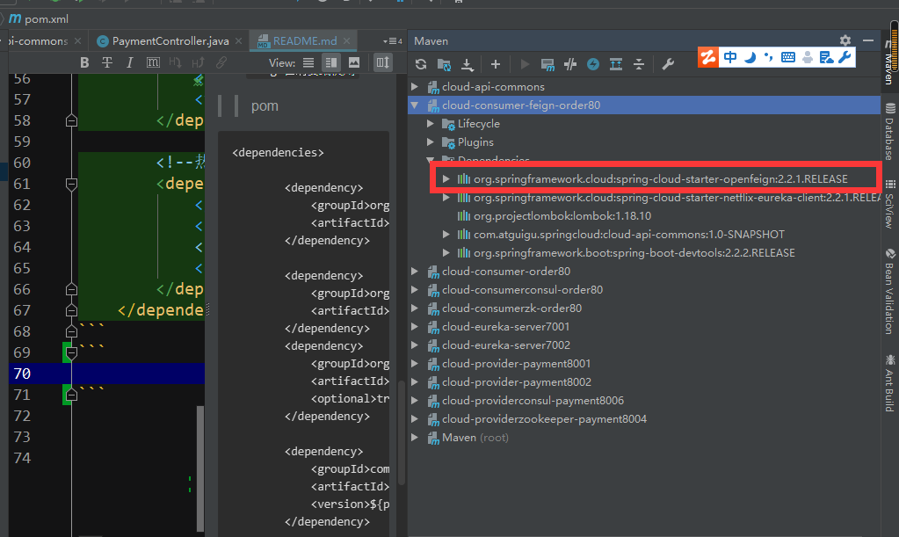

#H1
######H6
`高亮`
* 无需列表1
* 无需列表2
  * 无需列表2.1
    * 无需列表2.1
>缩进1
>>缩进2

# cloud20210820
##springcloud学习
`gongliang`
>1
>>2
```static```
**加重**
> 应用

#2021-11-10
###OpenFeign
* 与Ribbon+RestTemplate作用类似
* 但是统一封装 这样每次都写Ribbon+RestTemplate,这样优雅简单
```xml
 <dependency>
    <groupId>org.springframework.cloud</groupId>
    <artifactId>spring-cloud-starter-openfeign</artifactId>
 </dependency>
```
> openFeign使用步骤
>> 接口+注解
* `微服务调用接口+@FeignClient`
>>新建cloud-consumer-feign-order80
* `Feign在消费端使用`
>> pom
```xml
<dependencies>

        <dependency>
            <groupId>org.springframework.cloud</groupId>
            <artifactId>spring-cloud-starter-openfeign</artifactId>
        </dependency>
        
        <dependency>
            <groupId>org.springframework.cloud</groupId>
            <artifactId>spring-cloud-starter-netflix-eureka-client</artifactId>
        </dependency>
        <dependency>
            <groupId>org.projectlombok</groupId>
            <artifactId>lombok</artifactId>
            <optional>true</optional>
        </dependency>

        <dependency>
            <groupId>com.atguigu.springcloud</groupId>
            <artifactId>cloud-api-commons</artifactId>
            <version>${project.version}</version>
        </dependency>

        <!--热部署-->
        <dependency>
            <groupId>org.springframework.boot</groupId>
            <artifactId>spring-boot-devtools</artifactId>
            <!--            <scope>runtime</scope>-->
            <optional>true</optional>
        </dependency>
    </dependencies>
```
* `能看到`


>> yml
```yaml
## 端口号
server:
  port: 80
##此处只当它是客户端,不当微服务(这个无所谓相加自己可以加)
eureka:
  client:
    #false 表示不向注册中心注册
    register-with-eureka: true
    #false 表示自己端就是注册中心，我的职责就是维护，并不需要检查
    fetch-registry: true
    service-url:
      #设置与eureka server交互的地址查询服务和注册服务需要依赖的这个地址
      #defaultZone: http://localhost:7001/eureka/
      defaultZone: http://eureka7001.com:7001/eureka/,http://eureka7002.com:7002/eureka/ #集群
```

